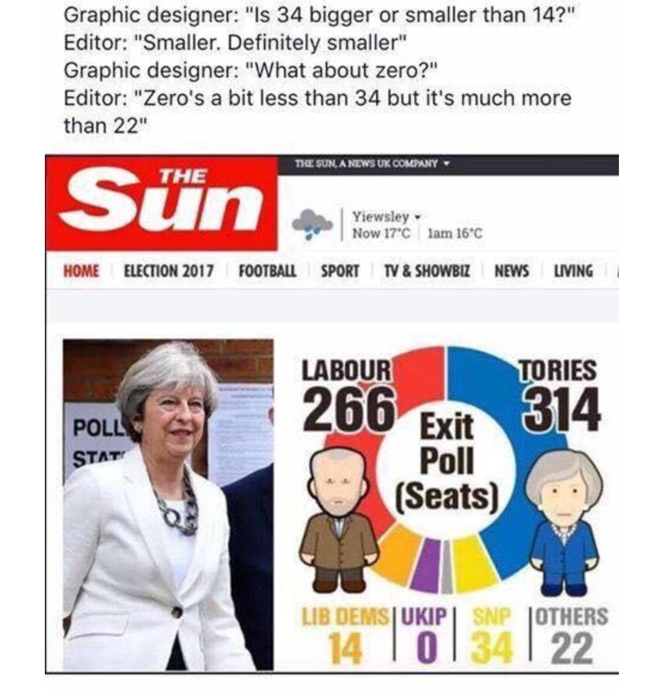
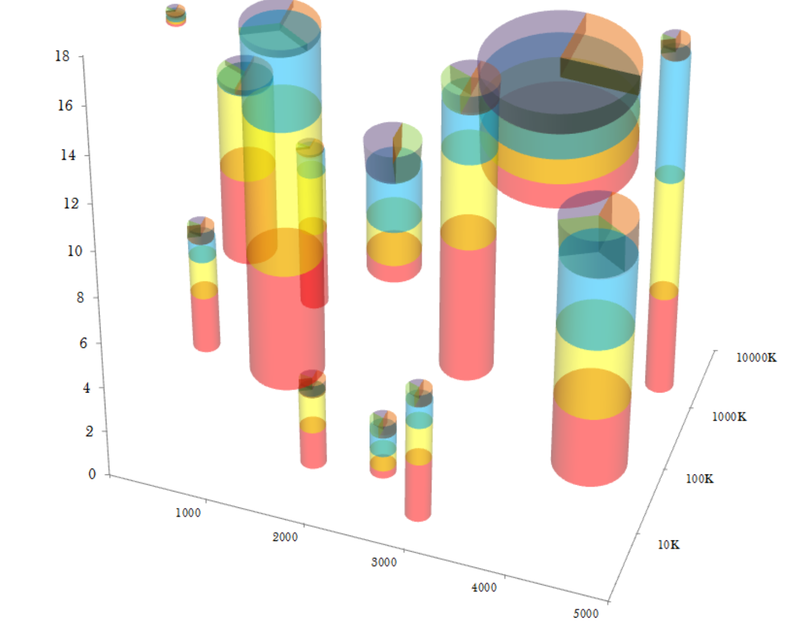
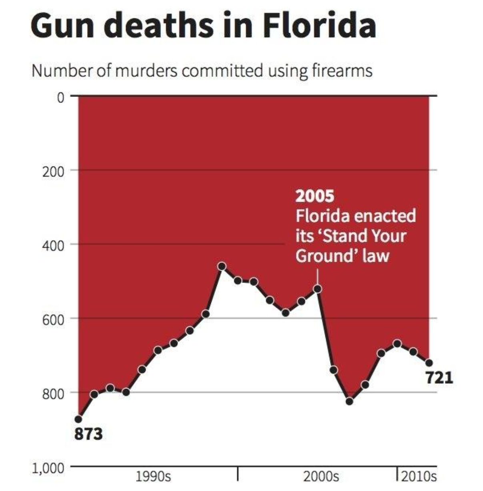
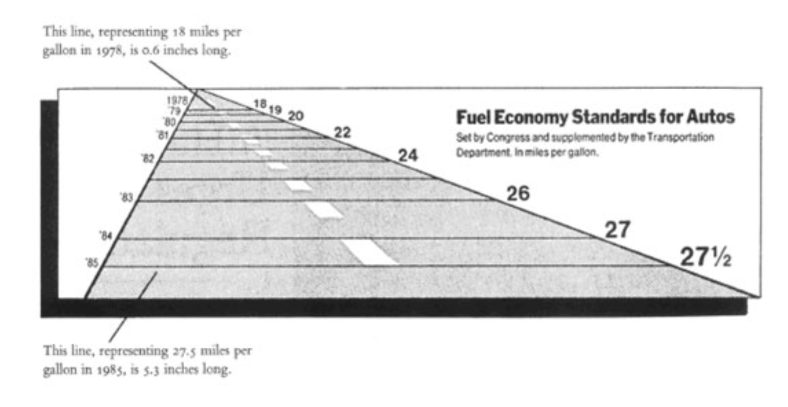
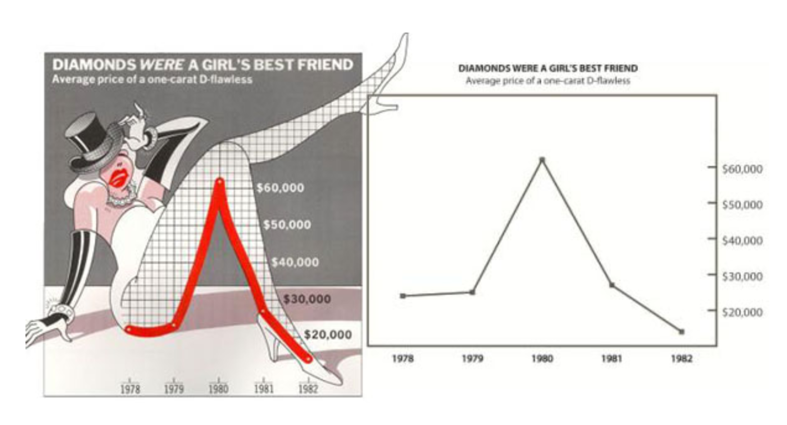
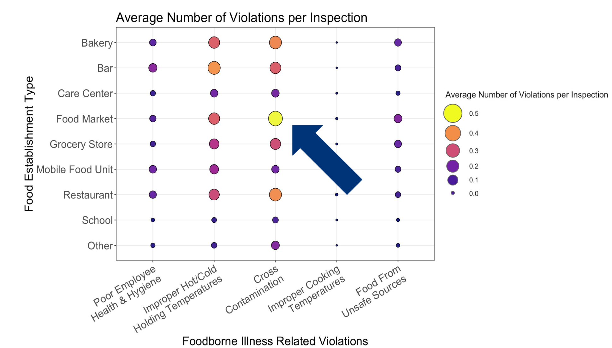
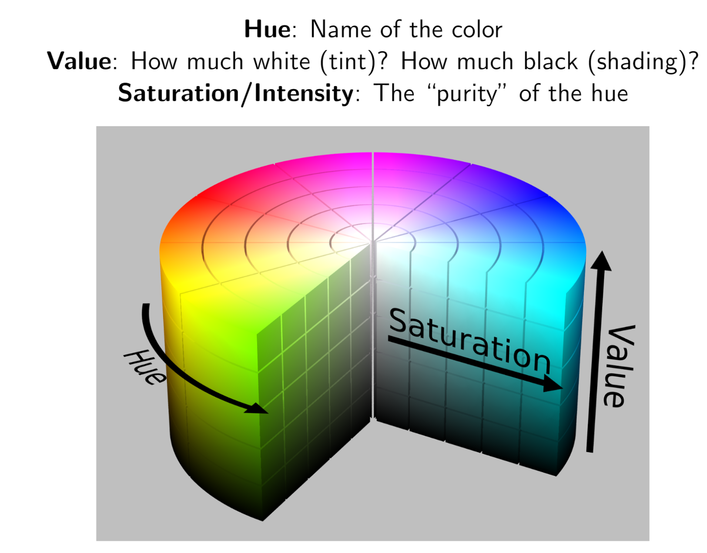

```{r setup, include=FALSE}
library(knitr) # We need the knitr package to set chunk options
library(tidyverse)
library(gridExtra)

# Set default knitr options for knitting code into the report:
opts_chunk$set(echo=FALSE,  # change to FALSE to keep code out of the knitted document
               cache=FALSE, # re-run code that has already been run?
               autodep=TRUE, # assure that caching dependencies are updated correctly
               cache.comments=FALSE, # do not re-run a chunk if only comments are changed
               message=FALSE, # change to FALSE to keep messages out of the knitted document
               warning=FALSE,  # change to FALSE to keep warnings out of the knitted document
               comment = NA,
               tidy.opts=list(width.cutoff=65))

theme1 <- theme_bw() +
  theme(axis.text = element_text(size = 8, colour = "#6b3447"),
        axis.title = element_text(size = 10, colour = "#2f2f63"),
        legend.title = element_text(size = 8, colour = "#2f2f63"),
        legend.text = element_text(size = 8, colour = "#6b3447"), 
        title = element_text(size = 12, colour = "#2f2f63"), 
        axis.ticks = element_line(colour = "#6b3447"),
        plot.caption = element_text(size = 8, colour = "#2f2f63"),
        plot.subtitle = element_text(size = 10, colour = "#2f2f63"))

library(MASS)
data("mtcars")
```

# Introduction

They say that a picture is worth a thousand words. However, they often fail to emphasize how important the selection of those thousand words is. A clear, concise, and informative graphic can save you lots of time and words describing and explaining your results. On the other hand, using a confusing, convoluted, poorly labeled graphic is the proverbial equivalent of randomly smacking your keyboard until you have 1000 words of jibberish in your report or presentation. Similarly, using a distorted or misrepresentative graphic is worth a couple of pages of text spent on misinforming the reader (which, to be fair, may be on purpose for some). Throughout your career as a data scientist, you will be making many data visualizations for both yourself and for others. The goal of this module is to try and get you to think about how you should create your graphics in order to provide as much accurate information as possible in an easily understood manner.

## Motivating Examples

{width=400px}

\newpage

{width=350px}

{width=300px}

# Aesthetics

If you have used the `ggplot` package in R, you probably know about the general code structure of how to create a plot:

```{r echo = TRUE, eval = FALSE}
ggplot(data = your_data) +
  geom_desired_plottype(mapping = aes(...))
```

But, you may have wondered: why is the first argument called `mapping`, and what is the meaning or significance of the `aes` function anyway? Well, the story starts with the name `ggplot` itself - the `gg` stands for *grammar of graphics*, which is a framework for describing graphics in a general sense rather than having different specifications for each different type of plot. One of the basic idea of the grammar of graphics is the idea of *aesthetics*, or things that we can percieve on the graph. For example, we can provide information to the reader by using positions on the x-axis or y-axis, colors, shapes, sizes, labels, linetypes, or one of many other different visual parameters.In general, we want to have a one-to-one mapping of variables in our data set to aesthetics in our graph. Under the `ggplot` technical framework, this mapping is specified when choosing the type of geometry (or plot) you want to us, hence the `mapping` argument specified by `aes`. 

When creating a data visualization, especially when trying to include more than 2 or 3 variables in the same plot, one should put some thought in to which variables in the data are mapped to which graph aesthetics. The choices of mappings can have a significant effect on the type of story that it tells the reader. For example, the two graphs below have the same 2 variables; however, the information that is clearly conveyed by both is different because we switched the aesthetics that were mapped to the x-axis and to the fill color. In particular, for this specific type of graph, it is easy to see the marginal distribution of the variable on the x-axis and the conditional distribution of the variable mapped to color given the variable on the x-axis. On the other hand, it is difficult to see the marginal distribution of the variable mapped to color.

```{r fig.height = 5}
g <- ggplot(data = mtcars) + theme1
g1 <- g + geom_bar(aes(x = factor(cyl), fill = factor(carb))) +
  labs(x = "Number of Cylinders",
       y = "Count",
       fill = "Number of Carburetors",
       title = "Various Statistics of 1974 Model Cars")

g2 <- g + geom_bar(aes(x = factor(carb), fill = factor(cyl))) +
  labs(x = "Number of Carburetors",
       y = "Count",
       fill = "Number of Cylinders",
       title = "Various Statistics of 1974 Model Cars")

grid.arrange(g1, g2)
```


\newpage

# Graphical Distortion

One principle that most people can agree on is that our graphs should represent the data as best as possible. Thus, we want our visual representation of the data to be consistent with the numerical representation. When a graph does not accurately match the data, we say that the graph *distorts* the data. Below, we see an extreme example. 

{width=500px}

In the graph above, we see multiple cases where the data are distorted. On the left hand side, the distances between the years should be all the same since they are all one year intervals; however, this is clearly not the case, as the gaps between the years seem to be somewhat arbitrary. Similarly, the lines that represent the mile per gallon fuel economy standards are not proportional to the actual data; the ratio of the bar that represents 27 MPG and the bar that represents 18 MPG is about 8.8, while the actual ratio between the two numbers is 1.5. 

Obviously, it may not always be possible to completely avoid distortion depending on the scale of your data; this can be a bit of a balancing act in certain cases. The point here is to avoid unnecessary data distortion, and to keep this in mind when making your visualizations.

\newpage

# Data Ink

Another guiding principle for good, concise data visualizations is that our graphs should not draw the viewer's attention away from the data. Extra "decorations" simply get in the way. This can be thought of in the framework of *data ink*, or the ratio of the amount of ink on the graph dedicated to showing non-redundant, useful information about the data to the overall amount of ink on the graph.

Below, we see two graphs that show the exact same information on diamond prices. However, the graph on the left has a lot of extra ink not dedicated to the data that only serves to distract the reader from the information presented (while also lacking an x and y axis!). 

{width=400px}

One common accidental way that data ink is overused is when mapping a variable to more than one aesthetic. For example, in the graph below, both color and size convey the same information. Using one or the other would provide the exact same information.

{width=400px}

\newpage

# Color Choice

One particular aesthetic that deserves a little more focus in the choice of color scales and gradients. At their best, color choices in your graph can be used to express certain ideas about your idea. Used incorrectly, however, colors in your graph can make your graph more difficult to interpret.

## Color Theory

{width=400px}

When picking colors for a plot, one should keep in mind how the selected colors are related to each other in the color wheel, either for color gradients or for labeling categories.

## Red and Green 

In short, try to avoid putting red and green as meaningful colors in the same graph. Why? Well, about 5% of the male population and 0.5% of the female population is red-green colorblind. Meaning, if this is what you want your audience to see:

```{r fig.height=3.5}
ggplot(data = mtcars) +
  geom_point(aes(x = mpg, y = hp, color = disp), size = 2) + 
  scale_color_gradient(low = "red", high = "green") +
  labs(x = "Gas Efficiency, Miles per Gallon",
       y = "Horsepower",
       color = "Disposition \n(cubic inches)",
       title = "Various Statistics of 1974 Model Cars") + 
  theme1
```

Approximately 1 in 50 people will instead see something akin to:

```{r fig.height=3.5}
ggplot(data = mtcars) +
  geom_point(aes(x = mpg, y = hp, color = disp), size = 2) + 
  scale_color_gradient(low = "#a58e48", high = "#d8b138") +
  labs(x = "Gas Efficiency, Miles per Gallon",
       y = "Horsepower",
       color = "Disposition \n(cubic inches)",
       title = "Various Statistics of 1974 Model Cars") + 
  theme1
```

Not particularly easy to see the `Disposition` color scale now, is it? While it doesn't seem like this affects too many people, it is something that can easily be fixed by just adding a line of code to set your own custom color pallette and which can help ensure your graph is interpretable by your entire audience.

## Color Gradients

When we map color to a continuous variable, we generally use a color gradient to represent our scale. We want the choice of the values of the gradient to be intuitive to the reader so that the reader has an easier time understanding the graph. For example, in the graph below, the color gradient changes in hue. This may not be a very intuitive choice, since there is not really a meaningful association between the color gradient of blue to red to yellow and the numeric scale from 0 to 0.5. What might make more sense is to have a color saturation or color value gradient, e.g. having a gradient going from light blue to dark blue, or white to blue, as this is much more intuitive with respect to having a "low" vs. "high" values. Another common case is the case where we want a color gradient from -1 to 1; in this situation, we might have a gradient that goes from blue to white to red, in order to represent "large negative" vs. "near 0" vs "large positive" values.

{width=400px}

## Colors as Groupings

We often use colors to differentiate between different categories of a discrete variable in our graphics. However, instead of choosing these colors arbitrarily, we can choose colors specifically to express similarities or differences between different categories. Categories that are more similar to each other can be assigned more similar colors, while categories that may be very different from others can be assigned a contrasting color. For example, below, we plot a subset of the `diamond` data set, with diamond `clarity` mapped to color. We assign similar clarity ratings to similar colors, while we contrast different rating groups with colors that are further apart from one another. This can more easily help us find potential groups of diamonds with similar clarities, as opposed to if we just randomly assigned each clarity category and arbitrary color.

```{r}
ggplot(diamonds[1:100, ]) +
  geom_point(aes(x = x, y = y, color = clarity)) +
  scale_color_manual(values = c("#000000", "#cc3318", "#8e3100", "#d2cf1c", "#999744", "#00898e", "#1dcdd3", "#d3d3d3")) +
  labs(x = "Length (mm)",
       y = "Width (mm)",
       color = "Clarity Rating",
       title = "Diamond Clarity by Height and Width") +
  theme1
```


\newpage

# Reports and Presentations

Below are some miscellaneous things to keep in mind for graphics that you put in to your reports and presentations.

## Titles and Labels

All graphs should have titles and axis labels. All of these should be in proper English, not raw variable names. Units should be added to axis labels as appropriate. The graph below is NOT appropriate for a report or presentaion. What do the acronyms mean? What is the meaning of `0` and `1` of the variable `vs`? These are not questions that a reader should ever have to ask. 

```{r}
ggplot(data = mtcars) +
  geom_point(aes(x = mpg, y = hp, color = factor(vs)), size = 2) + 
  scale_color_manual(values = c("blue", "red")) +
  theme1
```

Similarly, do not ever include raw code output in your reports. If you must, clean it up and put it in a nicely formatted table.

## Why Should I Care?

All the graphs you include in your reports and presentations should be meaningful. They should help supplement the story about the data and the model that you are trying to tell. Any plot included that does not do this is a waste of space and time.

One common mistake made is to include an entire pairs plot in your findings. While these types of plots are great for some quick EDA, they are not something useful for an audience reading your report or watching your presentation. Do people really need to look at every single plot? Even if you choose to point out and highlight the relevant ones, why not just separately remake the interesting plots and just include just those? It will make your graphic both more efficient and easier to read.

```{r}
library(GGally)

ggpairs(diamonds[, 1:5], title = "Will Someone Really Need to See All 25 Plots?")
```

Another plot that commonly shows up is a regularization path plot for LASSO regression. While this may have been required in your homeworks back in the day, this really isn't that interesting or useful (on top of being confusing to someone that does not have an advanced background in statistics.) You could just tell us which predictors ended up being selected, perhaps in a table. This is much easier to understand and explain.


