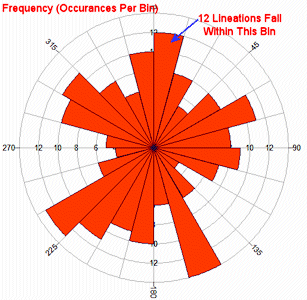

```{r setup, include=FALSE}
library(knitr) # We need the knitr package to set chunk options
library(tidyverse)

# Set default knitr options for knitting code into the report:
opts_chunk$set(echo=TRUE,  # change to FALSE to keep code out of the knitted document
               cache=FALSE, # re-run code that has already been run?
               autodep=TRUE, # assure that caching dependencies are updated correctly
               cache.comments=FALSE, # do not re-run a chunk if only comments are changed
               message=FALSE, # change to FALSE to keep messages out of the knitted document
               warning=FALSE,  # change to FALSE to keep warnings out of the knitted document
               comment = NA,
               tidy.opts=list(width.cutoff=65),
               fig.height = 4)

theme1 <- theme_bw() +
  theme(axis.text = element_text(size = 8, colour = "#6b3447"),
        axis.title = element_text(size = 10, colour = "#2f2f63"),
        legend.title = element_text(size = 8, colour = "#2f2f63"),
        legend.text = element_text(size = 8, colour = "#6b3447"), 
        title = element_text(size = 12, colour = "#2f2f63"), 
        axis.ticks = element_line(colour = "#6b3447"),
        plot.caption = element_text(size = 8, colour = "#2f2f63"),
        plot.subtitle = element_text(size = 10, colour = "#2f2f63"))

cbPalette <- c("#999999", "#E69F00", "#56B4E9", "#009E73", "#F0E442", "#0072B2", "#D55E00", "#CC79A7")
```

# Introduction

In this code module, we demonstrate the standard graphics for displaying a single dimension of data. These are tried and true methods for conveying the most information as efficiently and as easily interpretable as possible, and one should avoid deviating from these without careful consideration. We also talk about some graphics that are used but which should be avoided in favor of better displays. We consider graphics for both continuous and categorical data. Below, we use `ggplot` to create our graphics.
\newpage

# Categorical Data

## Bar Charts

The most common way to display the distribution of a single categorical variable is a bar chart. The plot uses rectangular bars to represent the count of each category of the variable. The heights of the rectangles are proportional to the counts, while the widths are all the same.

**NB: This is not a histogram. Those are for continuous data. Attempts to call this a histogram will result in reprimand.**


```{r}
ggplot(data = mtcars) +
  geom_bar(aes(x = cyl)) +
  labs(x = "Number of Engine Cylinders",
       y = "Count",
       title = "Engine Cylinders of 1974 Car Models") +
  theme1
```


\newpage

## Death to Pie Charts

You might have seen a pie chart before. It looks something like this: 

```{r}
mtcars_add <- table(mtcars$carb)

ggplot() +
  geom_bar(aes(x = factor(1), y = as.numeric(mtcars_add), 
               fill = levels(factor(mtcars$carb))),
           stat = "identity") +
  coord_polar(theta = "y") +
  labs(x = "", y = "", fill = "Number of Carburetors",
       title = "Carburetors of 1974 Car Models") +
  scale_y_continuous(labels = NULL) + 
  scale_x_discrete(labels = NULL) + 
  theme1
```

Pie charts are almost universally hated by statisticians. In general, there is really no good reason to use a pie chart over a bar chart. This is for several reasons:

- It is difficult to measure the exact percentages of each category without adding extra labels. This violates the princple of maximizing data ink.
- It is more difficult to compare categories that are not adjacent to each other compared to a bar chart.
- We have to use color to differentiate the different categories, which we don't need to for a bar chart. This violates the princple of maximizing data ink.
- Pie charts do not scale well with increasing the number of categories. Comparing more than 10 categories of a variable is nearly impossible with a pie chart.
- Comparing two pie charts side by side is much more difficult than comparing two bar charts. We can line up the bar charts to the same scale and compare heights. However, for a pie chart, comparing angles is much more difficult to accurately percieve.

\newpage

## Rose Plots

Rose plots are bar charts plotted in polar coordinates. This is useful in the very specific case when the categories in your bar charts are directions in a circle. This most commonly occurs in meterology and geology, where directions of movement are commonly studied. An example from the Internet is shown below from an actually relevant application. To do this in `ggplot`, one can simply add `+ coord_polar()` to a barplot geometry.

{width=400px}

\newpage

## Spine Charts

Spine charts are similar to bar charts, except the rectangles are stacked one on top of the other. Compared to a bar chart, it is slightly easier to compare the proportions of each of the categories. However, it has some of the flaws of the pie charts as well.

```{r}
ggplot() +
  geom_bar(aes(x = factor(1), y = as.numeric(mtcars_add),
               fill = levels(factor(mtcars$carb))),
           stat = "identity") +
  labs(x = "Number of Engine Cylinders",
       y = "Count", fill = "Number of Carburetors",
       title = "Carburetors of 1974 Car Models") +
  theme1
```

\newpage

# Continuous Data

## Histograms

The most common way to display the distribution of a single continuous variable. The plot uses rectangular bars to represent the number of observations of a variable within an interval. The heights of the rectangles are proportional to the counts, while the widths are all the same.

**NB: This is not a bar chart. Those are for categorical data. Attempts to call this a bar chart will result in reprimand.**

```{r}
ggplot(data = mtcars) +
  geom_histogram(aes(x = mpg),
                 color = "black") +
  labs(x = "Miles per Gallon",
       y = "Count",
       title = "MPG of 1974 Car Models") +
  theme1
```

\newpage

## Density Plots

Density plots display an estimated distribution from the observed values of a continuous variable. This is generally done using kernel density estimation to create a smooth distribution. The advantage over a histogram is that we get a smooth, continuous function as the distribution of the variable, rather than a binned discrete estimate. However, the result of the kernel density estimator can be dependent on choices of the parameters of the procedure, and can potentially add positive probability to values outside of the domain of the distribution.

```{r}
ggplot(data = mtcars) +
  geom_density(aes(x = mpg),
               fill = "grey") +
  labs(x = "Miles per Gallon",
       y = "Count",
       title = "MPG of 1974 Car Models") +
  theme1
```

\newpage

## Rug Plots

A rug plot simply adds the location of the actual observed values at the bottom of a plot of a continuous variable. This can be useful if the location of the values is an important part of the story of the graphic. This is generally not necessarily unless it shows something interesting that a density plot or histogram fails to pick up.

```{r}
ggplot(data = mtcars) +
  geom_density(aes(x = mpg),
               fill = "grey") +
  geom_rug(aes(x = mpg)) +
  labs(x = "Miles per Gallon",
       y = "Density",
       title = "MPG of 1974 Car Models") +
  theme1
```

\newpage

## Boxplots, and Why You Should Avoid Them

You might have seen a boxplot before. It looks something like this: 

```{r}
ggplot(data = mtcars) +
  geom_boxplot(aes(x = factor(1), y = mpg)) +
  labs(x = "",
       y = "MPG",
       title = "MPG of 1974 Car Models") +
  scale_x_discrete(labels = NULL) + 
  theme1
```

In general, there is really no good reason to use a boxplot over a density plot or a histogram. This is for several reasons:

- A boxplot only shows the median, interquartile range, minimum, and maximum values, as well as potential outliers. This is a huge loss of information compared to what a density plot can show, which is the full general shape of the distribution.
- Two very different distributions can have similar looking boxplots.
- The definition of outliers is arbitrary and honestly somewhat meaningless.
- The exact same information a boxplot provides can literally be achieved just by drawing vertical lines on top of a density plot.
