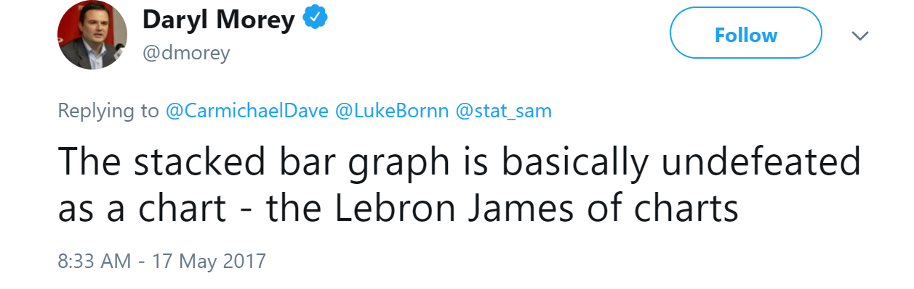

```{r setup, include=FALSE}
library(knitr) # We need the knitr package to set chunk options
library(tidyverse)
library(MASS)

# Set default knitr options for knitting code into the report:
opts_chunk$set(echo=TRUE,  # change to FALSE to keep code out of the knitted document
               cache=FALSE, # re-run code that has already been run?
               autodep=TRUE, # assure that caching dependencies are updated correctly
               cache.comments=FALSE, # do not re-run a chunk if only comments are changed
               message=FALSE, # change to FALSE to keep messages out of the knitted document
               warning=FALSE,  # change to FALSE to keep warnings out of the knitted document
               comment = NA,
               tidy.opts=list(width.cutoff=65),
               fig.height = 4)

theme1 <- theme_bw() +
  theme(axis.text = element_text(size = 8, colour = "#6b3447"),
        axis.title = element_text(size = 10, colour = "#2f2f63"),
        legend.title = element_text(size = 8, colour = "#2f2f63"),
        legend.text = element_text(size = 8, colour = "#6b3447"), 
        title = element_text(size = 12, colour = "#2f2f63"), 
        axis.ticks = element_line(colour = "#6b3447"),
        plot.caption = element_text(size = 8, colour = "#2f2f63"),
        plot.subtitle = element_text(size = 10, colour = "#2f2f63"))

cbPalette <- c("#999999", "#E69F00", "#56B4E9", "#009E73", "#F0E442", "#0072B2", "#D55E00", "#CC79A7")
data(Cars93)
```


# Introduction 

In this code module, we demonstrate the standard graphics for displaying two dimensions of data. These examples focus on methods which display as much relevant information as possible, maximize data ink, and are easily interpretable. We consider graphics for 2 categorical variables, 2 continuous variables, and a mix of categorical and continuous variables. Below, we use `ggplot` to create our graphics.

\newpage

# Two Continuous Variables

## Scatterplots

The easiest and most logical way to plot 2 categorical variables on a graph is to map them to the x- and y-axes; this is called a scatterplot. This type of plot will serve as the basis for the other types of 2D continuous plots shown below.

```{r}
ggplot(data = Cars93) +
  geom_point(aes(x = MPG.city, y = MPG.highway)) +
  labs(x = "City MPG", y = "Highway MPG",
       title = "City vs. Highway MPG, '93 Car Models") +
  theme1
```

In the case where you may want to point out individual data points (e.g., finding potential outliers), you can change the point type to be the labels for the individual observations. Note that this may look terrible if plotting a large number of points that are clustered together.

```{r}
ggplot(data = Cars93) +
  geom_text(aes(x = MPG.city, y = MPG.highway, label = Model)) +
  labs(x = "City MPG", y = "Highway MPG",
       title = "City vs. Highway MPG, '93 Car Models") +
  theme1
```

Scatterplots are also nice because we can map many different aesthetics to them. The size, shape, and colors of the points can all be mapped to different variables. Be warned, though, that with great power comes great responsibility; too many aesthetics on a single graph can become confusing to the reader and can make interpretation difficult.

```{r}
ggplot(data = Cars93) +
  geom_point(aes(x = MPG.city, y = MPG.highway, 
                 color = DriveTrain)) +
  labs(x = "City MPG", y = "Highway MPG",
       title = "City vs. Highway MPG, '93 Car Models",
       color = "Drive Train Type") +
  scale_color_manual(values = cbPalette) +
  theme1
```

```{r}
ggplot(data = Cars93) +
  geom_point(aes(x = MPG.city, y = MPG.highway, 
                 color = DriveTrain,
                shape = Type, size = Price)) +
  labs(x = "City MPG", y = "Highway MPG",
       title = "City vs. Highway MPG, '93 Car Models",
       color = "Manufacturer") +
  scale_color_manual(values = cbPalette) +
  theme1
```

## Trend Lines

If we want to see the relationship between the variables on the x- and y-axes in the prediction or regression sense, we can add a regression line to the figure. There are many possible types of lines that can be added. The addition of a standard error region (in grey) is also usually a good idea if the audience is statistically-minded.

```{r}
ggplot(data = Cars93) +
  geom_point(aes(x = MPG.city, y = MPG.highway)) +
  geom_smooth(aes(x = MPG.city, y = MPG.highway), method = "lm") +
  labs(x = "City MPG", y = "Highway MPG",
       title = "City vs. Highway MPG, '93 Car Models") +
  theme1
```

```{r}
ggplot(data = Cars93) +
  geom_point(aes(x = MPG.city, y = MPG.highway)) +
  geom_smooth(aes(x = MPG.city, y = MPG.highway), method = "loess") +
  labs(x = "City MPG", y = "Highway MPG",
       title = "City vs. Highway MPG, '93 Car Models") +
  theme1
```

## Contour Plots

Contour plots can be thought of as a discrete binned representation of a two dimensional continuous distribution. This is used if we are more interested in the joint density of two variables instead of the relationship between a response and a predictor, variable as above. Each of the segments on the plot represents a binned density level of the joint distribution between the variables on the x- and y-axes; all of the area within a plotted level have approximately the same joint density. This can be represented either by outlines or by color fills.

```{r}
ggplot(data = Cars93) +
  geom_density_2d(aes(x = Length, y = Width)) +
  geom_point(aes(x = Length, y = Width)) +
  labs(x = "Car Length (in)", y = "Car Width (in)",
       title = "Length vs. Width, '93 Car Models") +
  theme1
```

```{r}
ggplot(data = Cars93) +
  stat_density_2d(aes(x = Length, y = Width, fill = ..level..),
                  geom = "polygon") +
  labs(x = "Car Length (in)", y = "Car Width (in)",
       title = "Length vs. Width, '93 Car Models",
       fill = "Density") +
  theme1
```

## Heatmap

Heatmaps can be thought of as the continuous version of the contour plot. The idea is similar to above, but instead of showing different discrete density levels, we fill in each area of the graph by the density estimate of points along a grid in the two dimensional space.

```{r}
ggplot(data = Cars93) +
  stat_density_2d(aes(x = Length, y = Width, fill = ..density..),
                  geom = "raster", contour = FALSE) +
  scale_fill_gradient2(low = "white", high = "red") +
  labs(x = "Car Length (in)", y = "Car Width (in)",
       title = "Length vs. Width, '93 Car Models",
       fill = "Density") +
  theme1
```

\newpage

# Two Categorical Variables

When we have two categorical variables, we use different forms of bar charts to show the marginal distribution of one variable, along with the conditional variable of a second given a first. This means that we have to make a decision about which variable's marginal distribution to show.

## Stacked Bar Chart

In a stacked bar chart, we show the counts of one of the categorical variable as a typical bar chart. These bars are divided by fill height based on another categorical variable. Essentially, each of the overall bars is a stack of smaller bars.

```{r}
ggplot(data = Cars93) +
  geom_bar(aes(x = Origin, fill = DriveTrain)) +
  labs(x = "Origin", y = "Count",
       title = "Drive Train Type by Origin, '93 Car Models") +
  scale_fill_manual(values = cbPalette) +
  theme1
```


## Side-by-Side Bar Chart

Unlike above, where the distributions are shown by bars are stacked on top of one another, the side-by-side bar chart puts them next to each other. The sum of each of the groupings adds up to the count of the category of the variable shown on the x-axis. Which one you prefer is a matter of taste.

```{r}
ggplot(data = Cars93) +
  geom_bar(aes(x = Origin, fill = DriveTrain),
           position = "dodge") +
  labs(x = "Origin", y = "Count",
       title = "Drive Train Type by Origin, '93 Car Models") +
  scale_fill_manual(values = cbPalette) +
  theme1
```

## When in Doubt

{width=400px}

## Mosaic Plot

Mosaic plots are similar to bar charts, but are specifically geared towards looking at proportions of the categorical variable distributions rather than the counts. The marginal distribution of the variable on the x-axis is represented by the width of the bars, while the conditional distribution of the variable on the y-axis given the variable on the x-axis is shown by the heights of the bars. The widths and heights are standardized such that the width of the graph is constant and the heights of each of the bars are the same. Thus, this makes it easier to compare proportions for the conditional distribution of the variable on the y-axis for different categories of the variable on the x-axis.

```{r}
library(ggmosaic)

ggplot(data = Cars93) +
  geom_mosaic(aes(x = product(Origin), fill = Type)) +
  labs(x = "Origin", y = "Drive Train Type (Proportion)",
       title = "Drive Train Type by Origin, '93 Car Models") +
  scale_fill_manual(values = cbPalette) +
  theme1
```

However, there are a couple of downsides to the mosaic plot. First, we lose all information about the raw counts of the categories of the data. Also, they tend to look pretty awful when there are a lot of categories or when some of the categories are relatively small. as seen below.

```{r}
ggplot(data = Cars93) +
  geom_mosaic(aes(x = product(Cylinders), fill = Type)) +
  labs(x = "Engine Cylinders", y = "Drive Train Type (Proportion)",
       title = "Drive Train Type by Engine Cylinders, '93 Car Models") +
  scale_y_continuous(labels = NULL) +
  scale_fill_manual(values = cbPalette) +
  theme1
```

\newpage

# Mixed Variable Types

When we have one categorical and one continuous variable, we generally care about the conditional distriubtion of the latter given the value of the former. The examples shown below are for this case. In reverse case is a lot more difficult to visualize properly; one might think about the use of a stacked histogram or perhaps using a colored scatterplot (along with another continuous variable so that we can have a proper scatterplot with both an x- and y-axis.)

## Stacking

One way we can show multiple conditional distributions is by putting them one on top of the other. This is nice because we can see all of them on the same scale and because we can more easily make visual comparisons when everything is overlayed.

```{r}
ggplot(data = Cars93) +
  geom_density(aes(x = MPG.city, fill = Origin), 
               position = "dodge", alpha = 0.5) +
  labs(x = "City MPG", y = "Density",
       title = "City MPG by Origim, '93 Car Models") +
  scale_fill_manual(values = cbPalette) +
  theme1
```

Good luck trying to interpret the graph when there are many categories to compare, though.

```{r}
ggplot(data = Cars93) +
  geom_density(aes(x = MPG.city, fill = Type), 
               position = "dodge", alpha = 0.5) +
  labs(x = "City MPG", y = "Density",
       title = "City MPG by Type, '93 Car Models") +
  scale_fill_manual(values = cbPalette) +
  theme1
```

## Faceting

Instead of stacking the conditional distributions on top of one another, we can facet on the categorical variable. This puts each of the distributions side-by-side. This is much easier to view when there are many categories to compare. One can argue, though, that for two or three categories, stacking can make direct comparisons between the different distributions slightly easier.

```{r}
ggplot(data = Cars93) +
  geom_density(aes(x = MPG.city)) +
  facet_wrap( ~ Type) +
  labs(x = "City MPG", y = "Density",
       title = "City MPG by Type, '93 Car Models") +
  scale_fill_manual(values = cbPalette) +
  theme1
```

